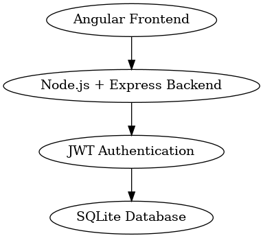
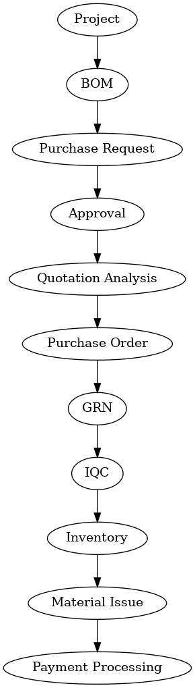

# Genrobotics ERP System

## Overview

This repository documents my contributions as a Software Development Intern at Genrobotics Innovations Pvt. Ltd.

The project involved developing and enhancing a full-stack Enterprise Resource Planning (ERP) system used for procurement, inventory management, vendor management, and workflow automation.

⚠️ Note: The source code for this project is proprietary and owned by Genrobotics Innovations Pvt. Ltd. Due to confidentiality requirements, the implementation cannot be publicly shared.

---

## Technologies Used

- Angular
- TypeScript
- Node.js
- Express.js
- Sequelize
- SQLite
- JWT Authentication
- Role-Based Access Control (RBAC)

---

## ERP Modules

### Procurement
- Purchase Request (PR)
- Purchase Order (PO)
- Quotation Management
- Vendor Management

### Inventory
- Goods Receipt Note (GRN)
- Inventory Tracking
- Material Requisition Note (MRN)

### Quality Control
- Incoming Quality Control (IQC)
- Rejection Management

### Administration
- User Management
- Permission Management
- Notification System

---

## My Contributions

- Developed procurement and inventory management modules.
- Developed Purchase Order Module
- Implemented RBAC and authentication workflows.
- Enhanced approval and notification systems.
- Participated in testing and deployment activities.

---

## ERP Workflow

Project
→ BOM
→ Purchase Request
→ Approval
→ Quotation Analysis
→ Purchase Order
→ GRN
→ IQC
→ Inventory
→ Material Issue
→ Payment Processing

## System Architecture

## ERP Workflow

